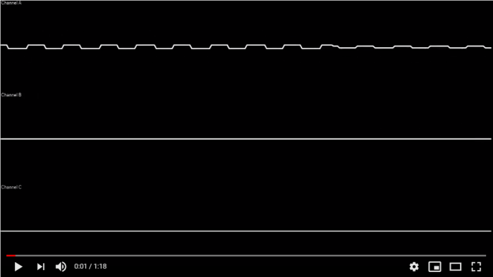
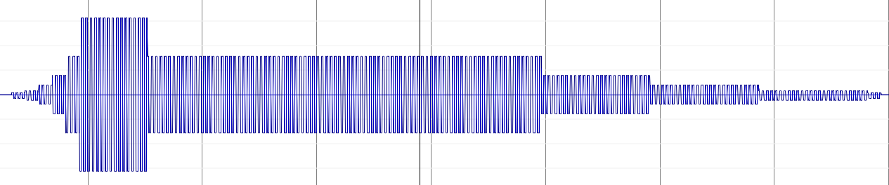
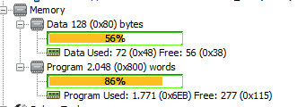
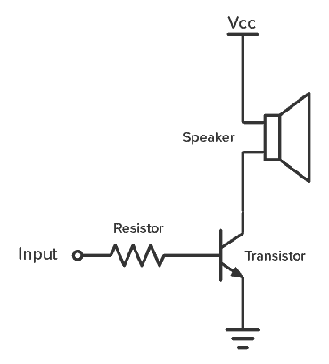

ADSR-based Polyphonic Sequencer for tiny PIC12/PIC16
=================================

This project is intended to be a polyphonic sequencer for use in
embedded 8-bit micro-controllers.  It features multi-channel direct synthesis with ADSR envelope, with a handy MML compiler.

This is a fork of the [sjlongland/atinysynth](https://github.com/sjlongland/atinysynth/) project for AT AVR MCUs, but optimized for the tiniest PIC12xxx Microchip microcontroller.

The goal is to implement a polyphonic tune player in only 2K instructions (containing the code *and* the tune data) and to stay in 128 bytes of RAM.

Spoiler: yes, that's possible, even using the free version of the [XC8 compiler](https://www.microchip.com/en-us/development-tools-tools-and-software/mplab-xc-compilers).

[](https://www.youtube.com/watch?v=ZJVwempHGbk)

_1:17 Korobeiniki (a.k.a Tetris A-type tune), 3 voices, 9.7kHz sampling rate, total size code+tune: 1771 code words, 72 RAM bytes, on a 8-pin PIC12F683_

ADSR: principle of operation
----------------------

The ADSR is a cut-down version of the main [sjlongland/atinysynth](https://github.com/sjlongland/atinysynth/) project.

Instead of allowing variable ADSR parameters, this fork implement a quasi-fixed envelope function, using only bit shift operators to avoid multiplications (that in a RISC MCU would kill the performances).

A clever way to optimize this is to follow the natural logarithmic scale of the human hearing, and use exponential gain instead of linear ones. With this approximation, the gain can be seen as a number of bit shifts:

```c
uint8_t gain = adsr_next(&(voice->adsr));
int8_t value = voice_wf_next(&(voice->wf));
// 8-bit domain
value >>= gain;
```



Every bit shift is approximately -10dB of gain.

The approximation of a continuous fade, so evident and ugly in the linear scale, is actually not so bad once played through a speaker.

> Since the PIC12/PIC16 doesn't have hardware support for multiple bit-shift, shifting is a O(N) operation. Limiting the fade to 5 or 6 bits (-50/-60dB) is necessary to avoid drop of performance and higher sampling rates.

Due to RAM limitation, every note only uses two dimensions for the ADSR envelope:

- time scale (number of samples between a state change);
- release start (the state machine counter at which the Release phase starts). This allows "staccato" and "legato" music modes (see MML support below).

## Sequencer

Since the synthesizer state machine is effective in defining when a "note" envelope is terminated, it is then possible to store all the subsequent "notes" in a stream of consecutive *frames*. Each frame contains a pair of waveform settings (period and amplitude) and the ADSR parameters (time scale and release start). 

This allow polyphonic tunes to be "pre-compiled" and stored in small binary files (microcontroller internal EEPROM or serial EEPROM), and to be accessed in serial fashion.

```c
// A frame
struct seq_frame_t {
    /*! Envelope definition */
    struct adsr_env_def_t adsr_def;
    /*! Waveform definition */
    struct voice_wf_def_t waveform_def;
};
```

Each tune are stored in a way that each frame in the stream should feed the next available channel when the ADSR ends.

In order to arrange the steps of all the channels in the correct sequence, a *sequencer compiler* has to be run on all the channel steps, and sort it correctly using an instance of the synth configured in the exact way of the target system (e.g. same sampling rate, same number of voices, etc...).

This compiler (`sequencer_compiler.c`) is not meant to run on the target microcontroller (it requires dynamic memory allocation), but to be run on a PC in order to obtain compact binary files to be played by the sequencer on the host MCU.

## Bit compressor: step 1

After the sequencer produced the stream of frames, now we need to squeeze it even more to fit in the code EEPROM (2K words of 14 bits).

> The data EEPROM of a tiny PIC12/PIC16 is often too small to fit a tune (usually 256 bytes).

Unfortunately the base level PIC12 doesn't expose any instructions to access to code memory at runtime, and hence use the whole 14 bits for every word.

However, the XC8 compiler is great in implementing constant array of values in code memory, using the 'Computed GOTO' technique as described in the Microchip data-sheet and hardcoded `RETLW` instructions.

With that, it is possible to put constant data packed as bytes in the code memory.

So the goal is to reduce the frame packet in - say - 2 bytes each, adding only a little bit more of computational required at runtime.

Analyzing the frame structure of a typical tune, we can say that the total _number_ of different notes and lengths is very less than the length of the whole tune.

So the compressor stage is simply mapping all the possible notes, lengths, and other frame definition values in tables that will be used to dereferencing the real value.

The result is then produced _as direct C source for XC8_. Here an example:

```c
// Tune: resources/scale.mml

struct tune_frame_t {
	uint8_t adsr_time_scale : 2;
	uint8_t wf_period : 4;
	uint8_t wf_amplitude : 1;
	uint8_t adsr_release_start : 2;
}; // wow! 9 bits!

const uint16_t tune_adsr_time_scale_refs[] = {
	0x0, 0x7d, 0x1f4, 
};

const uint16_t tune_wf_period_refs[] = {
	0x0, 0x1e9, 0x207, 0x225, 0x245, 0x268, 0x28e, 0x2b5, 0x2dd, 0x30a, 0x337, 0x369, 0x39c, 0x3d4, 
};

const uint8_t tune_wf_amplitude_refs[] = {
	0x0, 0x78, 
};

const uint8_t tune_adsr_release_start_refs[] = {
	0x0, 0x2f, 0x37, 0x3f, 
};

// 2 words per frame..
const struct tune_frame_t tune_data[] = {
	{ 1, 13, 1, 2 },
	{ 1, 12, 1, 2 },
	{ 1, 11, 1, 2 },
	{ 1, 10, 1, 2 },
	{ 1, 9, 1, 2 },
	{ 1, 8, 1, 2 },
	{ 1, 7, 1, 2 },
	{ 1, 6, 1, 2 },
	{ 1, 5, 1, 2 },
	{ 1, 4, 1, 2 },
	{ 1, 3, 1, 2 },
	{ 1, 2, 1, 2 },
	[...]
};
```

> `const` tells XC8 to place these data in the program memory.

So the `scale.mml` example only uses two different amplitudes, plus the 0x0 used by pauses, so it requires 2 bits per frames.

The note periods require 4 bits, the ADSR envelope only 2 (only 3 different envelope used), etc..

The total size of a packet dropped now to 9 bits. Without any other complex bit-level stream manipulation, the XC8 compiler will layout the necessary code to push the tune data in EEPROM (alongside with the ref tables), requiring only 2 bytes per notes.

## Banning *mul*s

The free version of the XC8 compiler (like any other non-optimized compiler for CPUs without native addressing with displacement) would produce the `_bmul` software implementation when a for-loop is written in this manner:

```c
uint8_t i = 0;
for (; i < MAX; i++) { 
    // ....
    consume(synth.voice[i].adsr);
}
```

The multiplication is used to compute the displacement of the target voice given `i` at each cycle, and it is especially slow if the size of the `struct voice_ch_t` is not a power of 2. In addition, the `_bmul` implementation will use precious code memory.

The same for-loop above written as:

```c
uint8_t i = 0;
struct voice_ch_t* ptr = &synth.voice[0];
for (; i < MAX; i++, ptr++) { 
    // ....
    consume(ptr->adsr);
}
```

is insanely faster (since it is implemented with simply additions and a temporary 8-bit pointer variable), and will save code space not producing the `_bmul` implementation.

## Banning (most of) stack variables

The low-specs PIC MCUs have a tiny hardware stack that can usually only arrange 8 levels of instruction pointers. 

However the XC8 compiler does a great job in implementing a software stack using global variables. The compiler analyze the full application call graph (every branch) and arrange the local variables in the global memory, sharing the memory used by locals declared in different branches.

This is great, and it works on the free version of XC8 (that doesn't optimize the code for speed).

However, every access to local variables is often translated in duplicated instructions <u>in the free version</u>:

```asm
     ;../../sequencer.c: 53:     uint8_t i = 3;
       	movlw	3
       	movwf	??_seq_feed_synth
       	movf	??_seq_feed_synth,w
       	movwf	seq_feed_synth@i
```

where the assignment of a the `seq_feed_synth@i` local requires 4 instructions, two of them playing the `W` value in way too much exuberant mood.

So the solution is to "uglify" the source code, and use more global variables than ever. For example, the pointer of the active voice in the voice loop is kept global to save it from being copied over in the waveform and ADSR state machines.

## Bit compressor: step 2

But the selected song for the demo (Korobeiniki, Tetris A-type with three voices) was however too big to fit in the 2K memory alongside the generator code.

And, by the way, wasting so many bits in packing frames in 2-byte packets was a shame.

So the last optimization step is to pack the frames in a bit-stream of fixed-packet sizes. This requires a little more complication in reading frames from memory, but this allows a 703 frames song to stay in 1056 bytes (so 1056 instructions of the 2K total memory).

```
Compiler stats:
        no clip (faster)
Distribution chart for 703 frames:
        adsr_time_scale: 18 (5 bits)
        wf_period: 23 (5 bits)
        wf_amplitude: 2 (1 bits)
        adsr_release_start: 2 (1 bits)
Stream size: 1056 bytes
```



And it uses only 72 bytes of RAM!

## PWM output

Most recent PIC12/PIC16 MCUs has native support for PWM output, so the waveform output can be written with a single instruction.

However, the registries used by the PWM modules are often arranged across 2 registers. The better performance can be reached using the higher 8 bits (of 10) with a single register access, leave the least significant bits as 0, and use a PWM frequency that can span exactly 10 bits of counter.

This can be reached on a PIC12F683 using a 20MHz external clock source (the maximum allowed), 1:1 prescaler and 2^10 as base counter, for a resulting 19.5kHz of modulation.

This is not ideal in a Hi-Fi system, but it usually outside the audible spectrum: with small speakers the modulation tone will not be there (at least, not for a dog I think).

Then, a practical choice will be a common emitter amplifier to drive a low-impedance speaker:



# Appendixes

## MML compiler

A very common language to define tunes in a quasi-human-readable fashion is the [Music Macro Language](https://en.wikipedia.org/wiki/Music_Macro_Language) (MML).

The project contains an implementation of a MML parser that creates a sequencer stream. In that way, it is possible to 'compile' tunes into binary streams, embed it in the microcontroller and play it from the sequencer stream with the least as computational power as possible.

The MML dialect implemented supports multi-voice: each voice can be specified on a different line, prefixed with the voice number (from *A* to *Z*).

| command       | meaning  |
| ------------- |-------------|
| `cdefgab` | The letters `a` to `g` correspond to the musical pitches and cause the corresponding note to be played. Sharp notes are produced by appending a `+` or `#`, and flat notes by appending a `-`. The length of a note can be specified by appending a number representing its length (see `l` command). One or more dots `.` can be added to increase the length of 3/2. |
| `p` or `r` | A pause or rest. Like the notes, it is possible to specify the length appending a number and/or dots. | 
| `n`\<n> | Plays a *note code*, between 0 and 84. `0` is the C at octave 0, `33` is A at octave 2 (440Hz), etc... | 
| `o`\<n\> | Specify the octave the instrument will play in (from 0 to 6). The default octave is 2 (corresponding to the fourth-octave in scientific pitch).
| `<`, `>` | Used to step up or down one octave.
| `l`\<n\> | Specify the default length used by notes or rests which do not explicitly define one. `4` means 1/4, `16` means 1/16 etc... One or more dots `.` can be added to increase the length of 3/2.
| `v`\<n\> | Sets the volume of the instruments. It will set the current waveform amplitude (127 being the maximum modulation).
| `t`\<n\> | Sets the tempo in beats per minute.
| `mn`, `ml`, `ms` | Sets the articulation for the current instrument. Stands for *music normal* (note plays for 7/8 of the length), *music legato* (note plays full length) and *music staccato* (note plays 3/4 of length). This is implemented using the *decay* of ADSR modulation.
| `ws`, `ww`, `wt` (*) | Sets the square waveform, sawtooth waveform or triangle waveform for the current instrument.
| `\|` | The pipe character, used in music sheet notation to help aligning different channel, is ignored.
| `#`, `;` | Characters to denote comment lines: it will skip the rest of the line.
| `&` | Bind two consecutive notes of the same frequency, but different duration, to a single note.
| `A-Z` (*) | Sets the active voice for the current MML line. Multiple characters can be specified: in that case all the selected voices will receive the MML commands until the end of the line.

(*) custom MML dialect.

The MML compiler is not optimized to run on a microcontroller (it requires dynamic memory allocation), but to be run on a PC in order to obtain the data to create a binary stream for the sequencer. The typical usage is a compiler for PC.

# Compiling

## PIC12/PIC16 port

You need the latest version of [MPLAB IDE](https://www.microchip.com/en-us/development-tools-tools-and-software/mplab-x-ide) to build for the Microchip MCU.

The project is optimized to be built even with the __free version__ of the [XC8 compiler](https://www.microchip.com/en-us/development-tools-tools-and-software/mplab-xc-compilers). Obviously using the PRO version you will be able to pack more tune data in the EEPROM.

The tune is stored in the rest of the program memory left, packed in a stream of bits in order to squeeze the MCU to the max.

But you need first to compile and launch the PC port.

## PC port (`pc`)

This uses `libao` and a command line interface to simulate the output of
the synthesizer and to output a `.wav` file.  It was used to debug the synthesizer.

The PC port must be used to compile MML tunes to the `tune_gen.c`/`tune_gen.h` source files:

* `compile-mml FILE.mml` compiles the .mml file and produces the `tune_gen.c`/`tune_gen.h` output in the current folder. In addition, it creates the `out.wav` for offline playback and waveform analysis.


